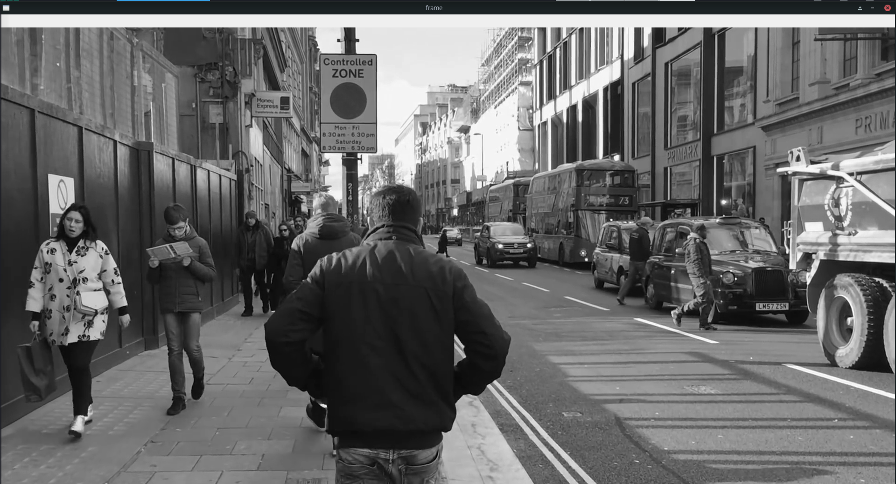
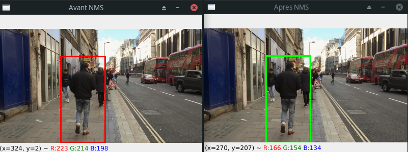

# Repository for the Backend-S3

This repository is made for the part of the project related to the camera system.

Current advancement on Sprint:


## Table of Content

- [Repository for the Backend-S3](#repository-for-the-backend-s3)
  - [Table of Content](#table-of-content)
  - [Quality Insurance](#quality-insurance)
  - [Installation](#installation)
  - [Program Usage](#program-usage)
- [Program](#program)
  - [Keybindings](#keybindings)
  - [Camera Mode](#camera-mode)
  - [Video Mode](#video-mode)
  - [Image Mode](#image-mode)
- [Information](#information)
  - [Developpers](#developpers)
  - [Sources](#sources)
    - [Youtube](#youtube)

## Quality Insurance

[](https://github.com/StudyBox-EIP/backend-s3/actions/workflows/python-quality.yml)
[](https://github.com/StudyBox-EIP/backend-s3/actions/workflows/python-tests.yml)
[](https://www.codacy.com?utm_source=github.com&amp;utm_medium=referral&amp;utm_content=StudyBox-EIP/backend-s3&amp;utm_campaign=Badge_Grade)


## Installation

To use this program on `Linux` you need to:
```shell
make
```
using this also generates `Camera` that is sym link to the main and that is already usable.

or you can use:
```shell
pip install -r requirements.txt
```
and to excute it you'll need to use:
```shell
python src/__main__.py
```

## Program Usage

**usage**:

- Camera [-h] [-f FILE] {cam,vid,img}

**positional arguments**:

- {cam,vid,img}: `this is the type of use wanted for the program`

**positional arguments**:

- -h, --help: `show this help message and exit`
- -f FILE, --file FILE: `this is the video used by the 'vid' type`

# Program

## Keybindings
| Function     | Key |
| ------------ | --- |
| Quit Program | Q   |

## Camera Mode
Camera mode uses your first camera to execute the porgram.


## Video Mode
Video mode uses the link given as a second argument with the `-f` flag as the main information for the program.


## Image Mode
This mode is temporary but it uses the folder `assets/pictures` to analyse how many people are in a frame at any moment and the correction done between 2 pictures.


# Information
## Developpers

- **Chief Programer**: Justin BLARD
- **Main Programer**: Justin BLARD

## Sources

### Youtube
| User           | Name                                             | Link                                        |
| -------------- | ------------------------------------------------ | ------------------------------------------- |
| Watched Walker | London Walk from Oxford Street to Carnaby Street | https://www.youtube.com/watch?v=NyLF8nHIquM |